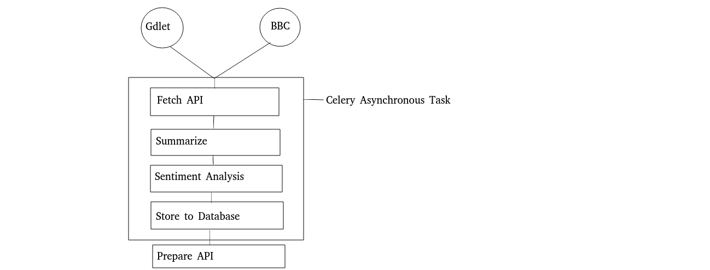

# News Feeds and Trends Aggregator

## 📌 Project Overview
This project is an AI-powered news aggregator that fetches, processes, and analyzes global news articles using **GDELT** data. It uses **Celery** with **RabbitMQ** for asynchronous task execution and integrates **AI-powered summarization & sentiment analysis** for enhanced news insights.

## 🚀 Features
- **Fetch News**: Pulls the latest news articles from the GDELT API.
- **AI-Powered Summarization**: Summarizes long news articles for quick reading.
- **Sentiment Analysis**: Classifies news articles as **Positive, Negative, or Neutral**.
- **Scheduled News Fetching**: Uses Celery Beat to automatically fetch news every 30 minutes.
- **Asynchronous Processing**: Uses RabbitMQ + Celery for background task execution.

---

## 📂 Project Structure
```
news_app/
│── NewsFeed/              # Django project directory
│   │── settings.py        # Django settings with Celery configuration
│   │── celery.py          # Celery initialization
│   │── __init__.py        # Celery import
│
│── NewsApp/                 # Django app
│   │── models.py          # News model
│   │── tasks.py           # Celery task for fetching news
│   │── serializers.py     # Django REST Framework serializers
│   │── views.py           # API views for news
│
│── requirements.txt       # Required dependencies
│── README.md              # Project documentation
```
---

---

## 🛠 Installation & Setup

### 1️⃣ Clone the Repository
```bash
git clone https://github.com/yourusername/news-app.git
cd news-app
```

### 2️⃣ Create a Virtual Environment & Install Dependencies
```bash
python -m venv venv
source venv/bin/activate  # MacOS/Linux
venv\Scripts\activate    # Windows
pip install -r requirements.txt
```

### 3️⃣ Set Up RabbitMQ (Message Broker)
```bash
sudo apt update && sudo apt install rabbitmq-server -y  # Ubuntu/Debian
brew install rabbitmq                                    # MacOS
rabbitmq-server                                          # Windows
```

### 4️⃣ Configure Django Settings (`settings.py`)
```python
CELERY_BROKER_URL = 'amqp://localhost'
CELERY_ACCEPT_CONTENT = ['json']
CELERY_TASK_SERIALIZER = 'json'
```

### 5️⃣ Run Database Migrations
```bash
python manage.py makemigrations
python manage.py migrate
```

### 6️⃣ Start Celery Worker & Beat Scheduler
```bash
celery -A news_app worker --loglevel=info
celery -A news_app beat --loglevel=info
```

### 7️⃣ Start Django Server
```bash
python manage.py runserver
```

---

## 🚀 Usage
### 1️⃣ Fetch News Manually
Run the Celery task manually via Django shell:
```python
from news.tasks import fetch_gdelt_news
fetch_gdelt_news.delay()
```

### 2️⃣ View Stored News in Django Shell
```python
from news.models import GDELTNews
print(GDELTNews.objects.all().values("title", "summary", "sentiment"))
```

---

## 📡 API Endpoints
| Method | Endpoint | Description |
|--------|---------|-------------|
| GET | `/api/news/` | Fetch all news articles |
| GET | `/api/news/{id}/` | Get details of a specific news article |

---

## 📜 License
This project is licensed under the MIT License.

---

## 🤝 Contributing
Pull requests are welcome! For major changes, please open an issue first to discuss what you would like to change.

---

## 📞 Contact
For inquiries, reach out to **your-email@example.com** or visit [your-website.com](https://your-website.com).

🚀 Happy Coding! 🎉

